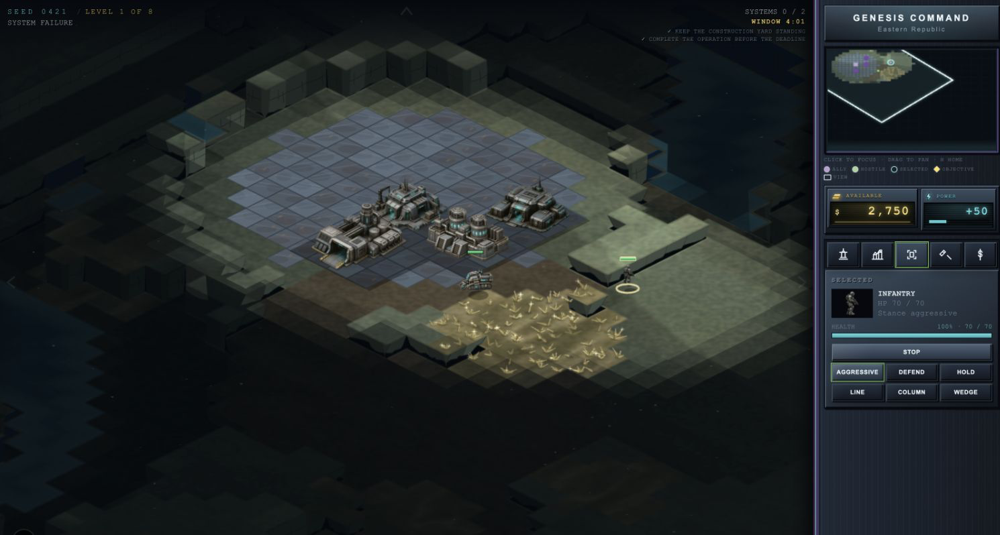

# Dynamica Command

Dynamica Command is a fully client-side browser **Command & Conquer–like** isometric RTS. One **4-digit seed** (`0000`–`9999`) deterministically generates the whole theater: factions, characters, campaign plot, mission maps, win conditions, and every sprite. Enter the same number later to resume; no account or backend is required.

**[Play from source](#run)** · [github.com/zakaihamilton/dynamica-command](https://github.com/zakaihamilton/dynamica-command)



## Run

Requires Node.js and [Yarn 1](https://classic.yarnpkg.com/) (`packageManager`: `yarn@1.22.22`).

```bash
yarn install --frozen-lockfile
yarn dev
```

Open the app, then choose **New Game** or type a seed such as `0421` and choose **Launch**. Progress autosaves in the browser under that seed. The welcome screen **TUTORIAL** opens a guided training range on seed `0000` with no time limit. The welcome screen **Options** (and pause Options) control **music and sound effects**, including separate volume sliders. Pause also opens save/load, portable export, and briefing. The generated sprite browser is public at **`/assets`**, with a public JSON API at **`/api/assets`**.

| Script | What it does |
| --- | --- |
| `yarn dev` | Next.js dev server |
| `yarn build` / `yarn start` | Production build and serve |
| `yarn test` | Vitest (headless, no browser) |
| `yarn typecheck` | TypeScript type checking without emitting files |
| `yarn test:e2e` | Playwright browser smoke test; runs a browser preflight first |
| `yarn inspect 0421` | Dump generated campaign JSON |
| `yarn sim --seed 0421 --mission 0 --ticks 200` | Tick a mission without the UI |
| `yarn balance --from 0 --to 39 --jobs 8 --check true` | Run the competent commander through the full mission horizon with bounded worker parallelism and enforce balance thresholds. `--jobs 1` is the serial reference; omit it for a bounded CPU-based default. CI samples seeds `0000`–`0039` (320 scenarios) with 8 workers. |
| `yarn health:invariants` | Validate generated campaign topology and scenario reachability across representative seeds |
| `yarn health:coverage` | Run focused V8 coverage; long generated-map and commander sweeps run in `health:invariants` |
| `yarn health:performance` | Enforce terrain atlas, simulation, combat, and routing performance budgets |
| `yarn health:balance` | Run the strict 320-scenario competent-commander acceptance sweep used by CI |
| `yarn compress-art` | Convert PNG art plates to alpha WebP (`--dry-run`, `portraits` / `sprites` / `terrain` / `all`) |

For local E2E runs, the preflight launches the same headless browser used by Playwright and reports an actionable install/path error before starting the app. Run `yarn playwright install chromium`, or point at an installed browser with `PLAYWRIGHT_CHROME_PATH=/absolute/path/to/chrome yarn test:e2e`. Ubuntu CI installs and runs the bundled Chromium as the authoritative browser environment.

## How a seed works

The four digits are hashed into forked RNGs (`world`, `faction:0`, `mission:3`, …). Generated campaign content is **not persisted**; it is regenerated from the same seed. Only mutable sim state (units, credits, fog, queues) is saved in `localStorage` as `dynamica-command:save:0421`. Audio preferences (`music` / `sound effects` toggles and volumes) persist separately as `dynamica-command:settings`.

```text
seed 0421
  ├─ world setting, tone, conflict
  ├─ two factions (names, palettes)
  ├─ commander, advisor, enemy leader (faces + copy)
  └─ 8 missions
       ├─ win category + parameters
       ├─ briefing
       └─ map (size, heightmap, resources, bases)
```

Share a seed to share a universe. Resume from the menu lists every local save, and each saved campaign opens its **operations map**. From New Game, enter or roll a seed and choose Operations map to inspect the theater before deployment. Select an operation to preview its primary and secondary objectives, expected duration, map scale, and unlocks before deploying. Unlocked operations can be launched from their generated briefing; completed operations can be replayed for better medals and scores.

## Campaign

Eight missions, about **5–20 minutes** each for classic and hold-the-line operations (later missions run longer). Fail-deadline scenario missions (`escort`, `sabotage`, `rescue`, `extraction`) use a longer casual window: **10–30 minutes** of active time (sabotage **12–30**), plus a 7-minute convoy staging period on escorts. Generated mission windows use whole-minute amounts; the live battlefield clock remains precise to the second. Every seed always includes the four scenario kinds (`escort`, `sabotage`, `rescue`, `extraction`) plus four of the eight classic win categories:

| Category | You win by… |
| --- | --- |
| Harvest quota | Earning a credit total (lifetime harvested, not current balance) |
| Force quota | Producing N units (any, or a seeded role such as tanks) |
| Structure quota | Completing N buildings |
| Destroy marked | Razing 1–3 tagged enemy structures |
| Raze all | Destroying every enemy building |
| Decapitate | Destroying the enemy construction yard |
| Annihilate | Wiping enemy units and buildings |
| Hold the line | Surviving a timer with your yard standing |
| Escort | Walking marked allies into a zone |
| Sabotage | Destroying marked structures before a deadline |
| Rescue | Freeing stranded units by reaching them |
| Extraction | Bringing cargo units back to your yard |

Lose if your construction yard falls (or the timer expires on a hold). Briefings use generated talking-head portraits and name the objective.

### Loop

Harvest resource fields → spend credits and power → place buildings → produce units → fight. From the first mission, barracks can produce Field Medics and factories can produce Repair Trucks. Escort missions use durable, unarmed Convoy Trucks as their marked targets; repair trucks remain player-producible support units. These unarmed support units automatically seek damaged friendly humans or vehicles respectively, restore health in deterministic pulses, and can be assigned with a right-click/tap or placed in hold mode with Stop. Damaged structures can be repaired from the sidebar wrench for a fraction of their build cost, or **sold** with the scrap tool (`F`) for a partial refund. Enemy AI expands, guards its yard, raids harvesters, uses support units, and falls back when battered. Maps grow from ~48×48 early to ~96×96 late, with **valleys, plains, hills, and mountains**. Units can climb one elevation step; a two-level drop is a cliff. Buildings need a flat footprint (no water, no overlap, one height).

Yards, power plants, and barracks are **2×2**; refineries and factories **3×2**; turrets are **1×1**. Each level allows at most one barracks and one War Factory. Hover a unit or building for a tooltip (kind, faction, HP, and extras such as harvester cargo or a marked target).

### Controls

| Input | Action |
| --- | --- |
| Left click / drag | Select |
| Right click | Move, attack, or harvest |
| Right click / touch friendly target | Assign a selected support unit to heal that compatible human or vehicle |
| Ctrl / Cmd + right click | Attack-move (harvesters still gather on ore) |
| Repair wrench / R | Click a damaged friendly building to start or stop repairs |
| Sell / F | Click a finished friendly building to scrap it for credits |
| Stop / X | Halt selected units |
| Selection panel | Stance (Aggressive / Defend / Hold) and formation (Line / Column / Wedge) |
| Minimap click / drag | Move camera focus |
| WASD / arrows | Pan |
| Q / E / T | Construction / production / selected tabs |
| 1–5 | Sidebar cameo (Ctrl+1–5 cancels) |
| H / Home | Jump to construction yard |
| Space | Center camera on selection |
| Esc | Pause, or cancel place/repair/sell |
| Hover | Tooltip on the unit or building under the cursor (shortcuts appear in HUD tips) |
| Sidebar left click | Place buildings and produce units from the command tabs |
| Sidebar right click | Cancel construction or a queued unit and refund its cost |
| Touch (under 800px) | Command tray for move, attack-move, harvest, stop, stance, and formation |

## Architecture

Next.js (App Router) + TypeScript + Canvas 2D. The browser is a renderer and input adapter. **`lib/gen` and `lib/sim` import nothing from the DOM** so tests and CLIs use the same functions as the UI. See [`docs/architecture.md`](docs/architecture.md) for the runtime state flow and extension boundaries.

The **battlefield draws sprites** (procedural specs and `public/art` rasters). CPU-projected 3D meshes (`draw3dModel`) are used for turret heads and the Asset Bay preview lab, not for units in play.

```text
app/           menu, briefing, play, tutorial, campaign, campaign-complete
components/    HUD, canvas, talking heads
lib/seed       4-digit seed → mulberry32 forks
lib/gen        world, factions, maps, story, sprite specs
lib/sim        tick, pathfinding, economy, combat, support, repair, AI, objectives
lib/iso        tile ↔ screen projection (DOM-free; used by render and audio)
lib/render     sprites, minimap, camera pan, CPU 3D turret/preview
lib/audio      generated SFX + seeded background music (Web Audio)
lib/persist    save/load + audio settings (localStorage or in-memory)
scripts/       inspect + headless sim
tests/         Vitest
```

### Public asset API

The Asset Bay is intentionally public and does not require an account or API key. The browser UI is available at `/assets`; JSON consumers can use these stable routes:

| Route | Purpose |
| --- | --- |
| `GET /api/assets` | List all generated assets; optional `category` is `unit`, `building`, `wreck`, or `rubble`. |
| `GET /api/assets/:id` | Return metadata, dimensions, source URL, and supported directions for one catalog ID such as `unit:infantry`. |
| `GET /api/assets/:id/preview` | Return an SVG preview; units accept `facing=0`–`7`, while buildings, wrecks, and rubble accept the default facing `0` only. |
| `OPTIONS /api/assets` | CORS preflight for the list endpoint. |

Responses advertise `apiVersion: 1`, allow cross-origin reads, and use a one-hour public cache (`Cache-Control: public, max-age=3600, s-maxage=3600`). Consumers should pin the API version and treat catalog IDs as the stable asset identifiers; a future incompatible contract will increment the version.

Units, buildings, portraits, biomes, and terrain plates are **seed-tinted rasters** under `public/art`, composited with procedural specs (cliffs, wrecks, damage overlays). SFX and **background music** are generated in Web Audio from the seed. Music adapts to mission pressure, while battlefield effects are rate-limited and subtly stereo-positioned. Welcome and pause **Options** expose independent toggles and volume controls.

### Headless API

```ts
createCampaign(seed)
createMission({ seed, missionIndex })
tick(state, commands?)
issue(state, command)   // move | attackMove | attack | support | harvest | build | produce
                        // cancelBuild | cancelProduce | repair | sell | stop | stance | formation
inspect(state)          // compact JSON: credits, counts, objective, result
```

`yarn sim` exit codes: `0` playing, `10` win, `11` lose.

Optional `--orders orders.json`:

```json
[{ "tick": 12, "command": { "type": "move", "unitIds": [4], "x": 10, "y": 8 } }]
```

The balance harness uses the same public command API as a player. It builds missing infrastructure, maintains power, produces counters and support units, and assigns objective-aware orders. It runs through the full generated operation window by default (up to 30 minutes, or 37 with escort staging); `--ticks` is an intentional shorter cap and `--check true` rejects any truncated scenarios. `--jobs N` assigns deterministic seed/mission scenarios to worker threads; results are sorted by seed and mission so `--jobs 1` remains a serial reference. Omit `--jobs` for a bounded worker count based on available CPU parallelism. Progress is printed to stderr for long runs; use `--progress false` to suppress it or `--progress-every 8` to report every eighth scenario. Use `--strategy baseline` to run the older harvest-and-attack baseline, `--details true` to include per-seed records, or `--check true` to enforce the softened 60–97.5% competent win-rate, ≤20% timeout, ≥40% per-kind/per-mission win-rate, zero reliability failures, and ≤40 average-casualty targets (override them with `--min-win-rate`, `--max-win-rate`, `--max-timeout-rate`, `--min-kind-samples`, `--min-kind-win-rate`, `--max-kind-timeout-rate`, `--max-truncated-rate`, `--max-average-casualties`, and the reliability flags). `yarn health:performance` measures late-game 96×96 commander-plus-simulation p95, terrain atlas cost, and blocked-LOS combat p95.

HUD `data-testid`s for browser smoke tests: `seed`, `credits`, `objective`, `mission-result`.

## Stack

- Next.js 16, React 19, TypeScript
- Canvas isometric renderer (no Phaser)
- Vitest + `tsx` for tests and CLIs
- CSS Modules for menu/HUD chrome
